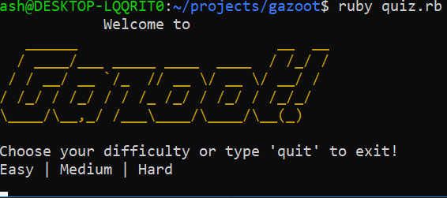
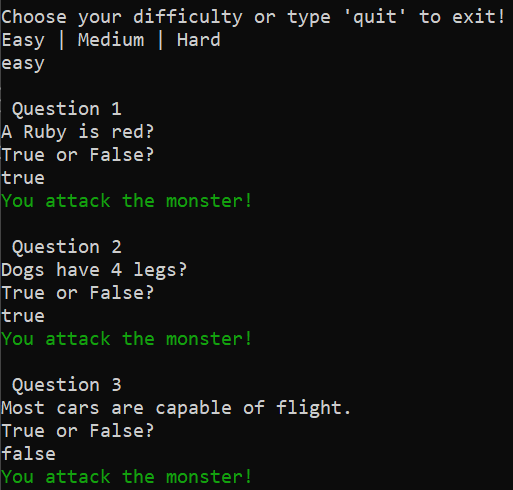
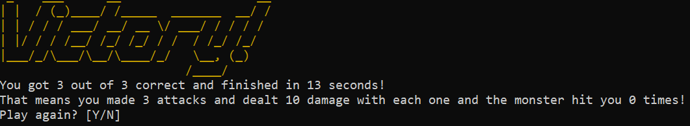
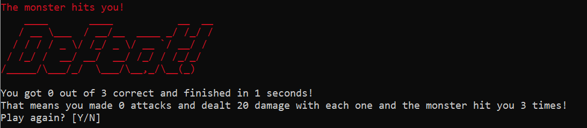

# Gazoot Ruby Application 

## Description

Gazoot is a quiz/action hybrid created using Ruby where answering questions correctly (and quickly!) allow you to attack and take down a monster! Winning the game involves answering enough questions to take the monsters health down to 0, with faster players being rewarded with a higher attack multiplier. This game was created as a way to review what was learnt in my first 2 weeks at Coder Academy and put it into practice.

Initially my first idea for an application was a workout tracker but I struggled to find motivation to complete and find a way to sufficiently meet the criteria of the assessment so the idea was scrapped in favour of Gazoot.

## Features

* Different quiz for each difficulty
* Recieve text input to select difficulty
* Display health of Player and Monster
* Victory and Defeat screens with final score
* Display time taken to finish quiz
* Reward user for completing quiz quickly
* Use of Ruby Gems colorize and artii

## User Interaction

Gazoot starts initially with a welcome screen before the player is prompted to select a difficulty, with each difficulty has a different set of questions to answer. 

Selecting a difficulty will then bring the user to the quiz, where they can input their desired answer to each question. A message will be displayed depending on whether or not the answer is correct. With each correct and incorrect answer a score will be raised for either the player or the monster which will be used once the quiz is completed to set how many attacks are made. A timer is also set so that an attack bonus can be added depending on how long it is taken to complete the quiz.

After the quiz has been completed, a screen will appear with details of how many answers were correct, the attack bonus they achieved and if they were successful in defeating the monster or if they failed.

At this point the player can choose to play again which will bring them back to difficulty select or they can quit out of the application.

## Intructions for use

1. Make sure you have ruby installed on your computer (if you don't you can follow the instructions for it [here](https://www.ruby-lang.org/en/documentation/installation/))
2. Download and unzip the files on your computer
3. On the terminal command line, change directory to root folder
4. Install bundler with "install bundler"
5. Use the command "bundle install" to download the required gems
6. Run the app using the command "ruby quiz.rb"

## Code Structure

1. quiz.rb
2. messages.rb
3. questions.rb

Initially the code structure was done within one ruby file but quickly became unwieldy and annoying to deal with so I tried to split it into a file for storing messages (messages.rb) and one for storing the questions themselves (questions.rb) so I could focus on making the quiz work as intended and add features to it as I saw fit.

## Design and Planning

A basic checklist was created using Trello detailing what an MVP would be and what a player would expect to be able to do with the application.

This brings me to my first issue which was the fact that there was minimal planning and design done before actually beginning to code. This resulted in a really slapped together all over the place document and I suffered in the long run because of it. In future I'll be sure to plan appropriately and have a design document I could refer back to during development.

I ended up sketching out a basic flowchart that I would refer back to so I could make sure I was on the right track from that point forward. It also made it clear what to seperate into classes, modules and what to properly do the next time I do an application.

## Development Timeline

## Gems

The gems that were in use for this app were:

* Artii for the ascii art for each message
* Colorize to add flavour throughout the app as well as for information clarity e.g. Red for incorrect questions